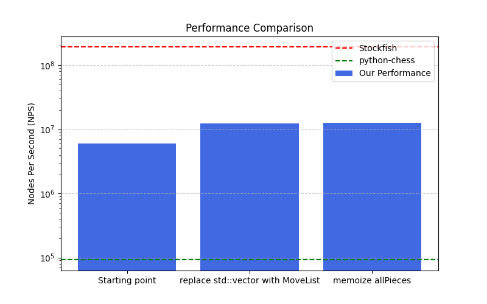

# Optimization

This document discribes the optimization process of the move generation.

## Stockfish performance

On the testing/fens10000.txt stockfish achieves 190,717,779 nodes per second (on perft with depth of 4).

This was determined by using the command:

`bench 16 1 4 testing/fens10000.txt perft`

## Python-chess performance

We only ran on the starting position and expanded all nodes to a depth of 4.
This achieved a nodes per second of 91,843.

This was measured using the `benchPyChess.py` script in the testing directory.

## Our performance

To measure the performance we have `testing/benchmarkMoveGen.cpp`.
We can run this either on all 10000 fens by doing `./testing/benchMoveGen` or add `--quick` to only test with 50 fens.

The values in this document are all from tests with 10000 fens.

### Optimization process

To optimize the performance we used callgrind to profile the performance (use `make profile`). Additionally the `./testing/benchMoveGen` was used.

The bellow image shows the progress made in optimizing the move generation.

### Initial performance results

The first version of the move generation achieves 5,980,028 nps (Nodes per Second).

### Removing the use of std::vector

In the move generation the move structs were added to a vector that was returned. From the profiling we observed ~50% of the execution time was spend on the `emplace_back` calls to create the move structs on the heap in the vector.
Using `reserve(30)` improved the performance significantly, but by completely replacing the vector with a MoveList which uses a preallocated array my code achieved an nps of 12,245,777.
