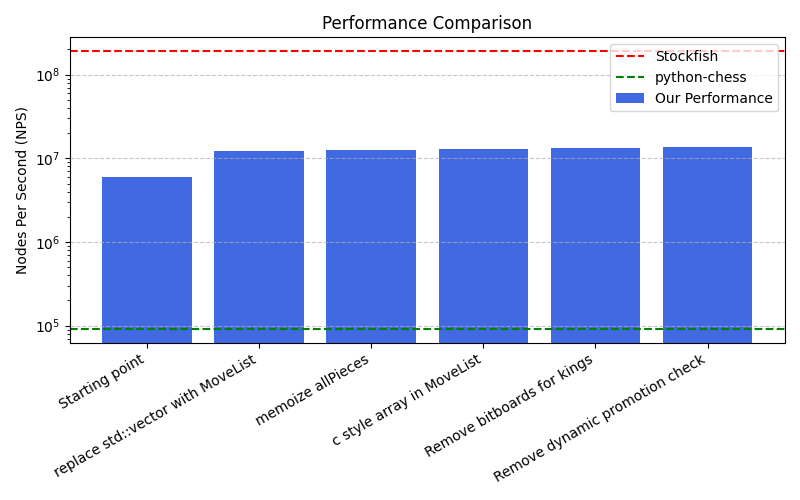

# Optimization

This document discribes the optimization process of the move generation.

## Stockfish performance

On the testing/fens10000.txt stockfish achieves 190,717,779 nodes per second (on perft with depth of 4).

This was determined by using the command:

`bench 16 1 4 testing/fens10000.txt perft`

## Python-chess performance

We only ran on the starting position and expanded all nodes to a depth of 4.
This achieved a nodes per second of 91,843.

This was measured using the `benchPyChess.py` script in the testing directory.

## Our performance

To measure the performance we have `testing/benchmarkMoveGen.cpp`.
We can run this either on all 10000 fens by doing `./testing/benchMoveGen` or add `--quick` to only test with 50 fens.

The values in this document are all from tests with 10000 fens.

### Optimization process

To optimize the performance we used callgrind to profile the performance (use `make profile`). Additionally the `./testing/benchMoveGen` was used.

The bellow image shows the progress made in optimizing the move generation.

### Initial performance results

The first version of the move generation achieves 5,980,028 nps (Nodes per Second).

### Removing the use of std::vector

In the move generation the move structs were added to a vector that was returned. From the profiling we observed ~50% of the execution time was spend on the `emplace_back` calls to create the move structs on the heap in the vector.
Using `reserve(30)` improved the performance significantly, but by completely replacing the vector with a MoveList which uses a preallocated array my code achieved an nps of 12,245,777.

### Memoization of allPieces

From the profiling we observed that or'ing together the pieces in the black and white piece sets took >10% of the execution time. Since the bitboards only update when a move is made we decided to memoize the bitboard of all white pieces and of all black pieces in the respective PieceSet instances and update them in when a move is made.
This increased performance to 12,618,242 nps. (In the profiling the allPieces now only uses ~6% of the execution time)

### replace std::array with c style array in MoveList
Achieved a slight increase to 12,981,934 nps.

### Store king square instead of bitboard
Since each side can never have more than one king, we can store kings as a single square instead of as a bitboard. This prevents us from having to find what bit of the bitboard is set to get the kings position. This change lead to an increase in performance to
13,466,706 nps.

### Use promotion flag instead of dynamically checking for promotion
In the makeMove function we were checking wether a promotion occured. This was unnecesary since the move already contains a flag for promotion and took up roughly 1% of execution time.
New performance is 13,558,534.

### Template on attacking color for squareAttacked
By templating we remove some runtime computation since the template is evaluated at compile time.
New performance is 13,688,515.

### Single XOR piece movement on bitboard
Removing the bit from the previous position in `makeNormalMove` was previously done using an and with the negation of the location of the piece. Now we use the fact that the bit should be on to do the placement and removal of the piece in one XOR.
These seperate opperations were previously 3.44% of execution and are now 2.64%.
New performance is 13,822,188 nps.

